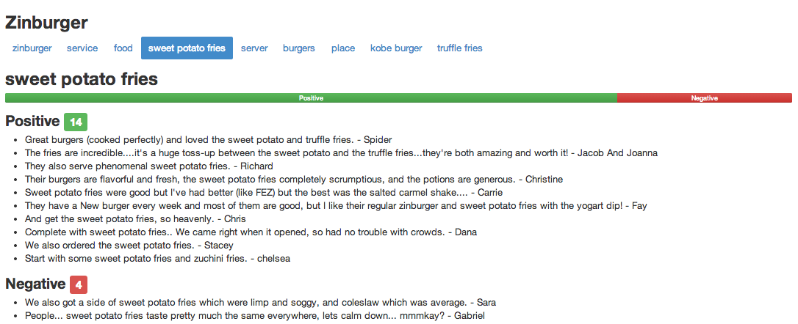

## Yelp Summarization Miner (YUMM)

Yelp Summarization Miner (or **YUMM**) is an automated system that uses machine learning and natural language processing to generate a digestable, human-understandable, and browsable summary of the opinions expressed in a corpus of Yelp reviews about a particular restaurant. YUMM's summary aims to provide the user with an at-a-glance understanding of a restaurant's features (or *aspects*) as well as reviewers' attitudes towards these features. 

You can check out a demo of YUMM online [here](http://www.jeffreyfossett.com). If that's not your style, here's a screenshot of YUMM in action (for a restaurant called **Zinburger**): 

YUMM generates a summary of this form in a completely automated fashion from the raw text (and metadata) of Yelp reviews about a restaurant. The items in blue at the top are the "aspects" that YUMM has extracted from the reviews ("service", "food", "sweet potato frieds" etc.). These are the salient features of the restaurant that reviewers often comment on. 

When one of the aspects is selected, YUMM displays a summary of reviewers' attitudes towards the aspect. The Positive/Negative bar (see screenshot) displays the overall balance of sentiment that YUMM uncovered in the data with respect to the chosen aspect. YUMM also provides supporting evidence in the form of snippets from reviews. 

### Code Overview

If you are interested in exploring YUMM's code, the main directories of interest are `./classes`, which contains the code for YUMM's primary summary-generation pipeline, and `./modeling`, which contains the code for training/optimizing the machine learning models that currently power YUMM.  

### Other Notes

I'm in the process of writing more detailed technical/non-technical documentation for YUMM. Non-technical overviews will be posted on my blog [here](http://jfoss.ghost.io). Technical documentation will be included in this repo in the directory that it is most relevant to. 

### References

The problem of automatic review summarization has been addressed in academic literature. See especially: 

* Blair-Goldensohn et al.'s ["Building a Sentiment Summarizer for Local Service Reviews"](http://www.ryanmcd.com/papers/local_service_summ.pdf) (2008)
* Bing Liu's [Sentiment Analysis and Opinion Mining](http://www.cs.uic.edu/~liub/FBS/SentimentAnalysis-and-OpinionMining.pdf) (2012)
* Hu & Liu's [Mining and Summarizing Customer Reviews](http://users.cis.fiu.edu/~lli003/Sum/KDD/2004/p168-hu.pdf) (2004)